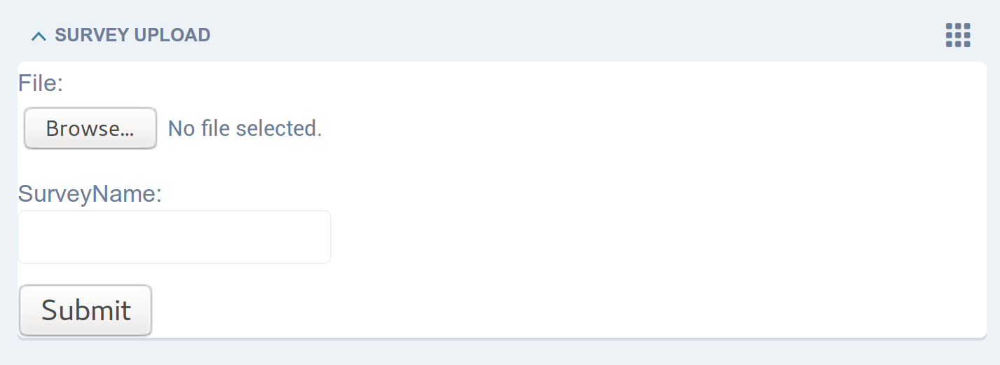
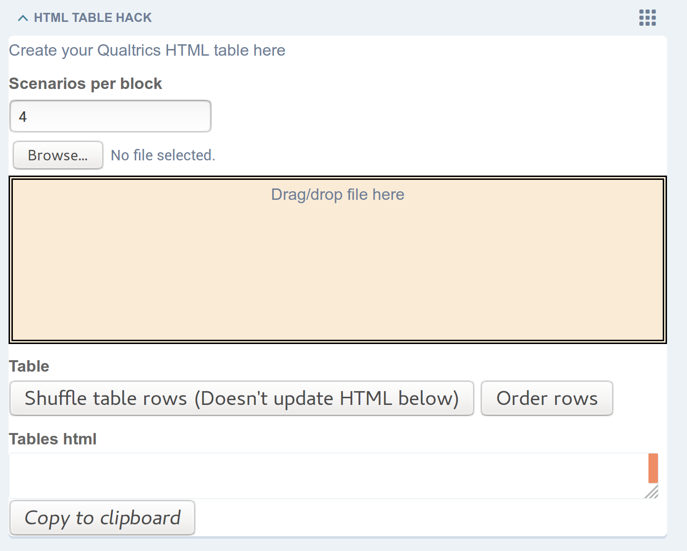
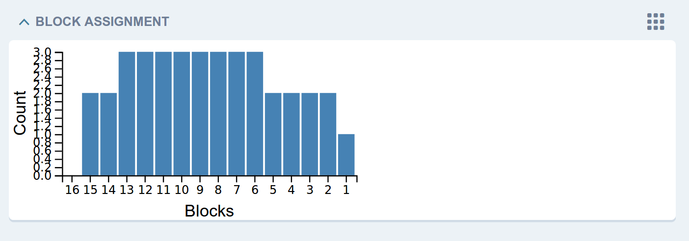
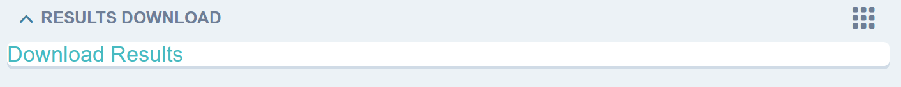

Administrator Guide
===================

Admin instructions

------------
Installation
------------

The MetroSurvey platform is a Django based system, and is built using version 2, python3.5

Installation is standard for python projects, using venv and pip.

Check out the code from GitHub, copy to a convienent installation directory, and run::

    pip install -r requirements.txt

Run the migrations using::

    python manage.py migrate

Test the webserver runs by using::

    python manage.py runserver

And the output similar to::

    Performing system checks...

    System check identified no issues (0 silenced).

    December 05, 2018 - 15:14:56
    Django version 2.0.4, using settings 'MetroSurvey.settings'
    Starting development server at http://127.0.0.1:8000/
    Quit the server with CONTROL-C.

Shows the server is running on the default port of ``8000``

------------
Add the data
------------

Django admin is used to manage each survey, so first we need an administrator user to log in with::

    python manage.py createsuperuser

and complete the inputs requested.

Via a web browser, navigate to the admin page at ``/admin``. Log in using the credentials just created.

At the ``SURVEY UPLOAD`` widget, use the ``Browse`` dialog option to select the Excel spreadsheet of ``Attributes & Levels`` and ``Design Matrix`` worksheets, :doc:`described here </input_data>`.

--------------------------------
Get the info from the admin page
--------------------------------

--------------------------
Add the stuff to Qualtrics
--------------------------

Create the survey in Qualtrics.

In Survey Flow, add the Web Service details as described below.

==========================
Participant Initialisation
==========================

In the Survey Flow tab of the Qualtrics survey, add Web Service block near the beginning of the survey.

This may be after the initial "Welcome" page, if you've added one, or after any legal/data collection/consent questions, to give the participant the opportunity to opt-out of beginning the survey if they do not agree with the terms.

Set the URL to ``https://<name_of_survey>.survey.<your_web_host_address>/get_participant/``

Set the ``Method`` to ``GET``

Use the ``Test`` button to ensure a connection is possible to your MetroSurvey installation, and the response is valid.

Save ``session`` as ``session_<name_of_survey>`` in the ``Set Embedded Data`` section. Do this for each MetroSurvey survey in the Qualtrics survey.

============
JSON Choices
============

In the Survey Flow tab, add another Web Service block before the question which will be showing the choice card.

This will request the contents of the next choice card from the MetroSurvey service, and the response will be recorded in Qualtrics to populate the choice card before presenting it to the participant.

Set the URL to ``https://<name_of_survey>.survey.<your_web_host_address>/json_choices/``

Set the ``Method`` to ``POST``

Set the ``Body Parameters`` to ``application/json``

Add a Body Parameter with the text ``participant_uuid`` in the first textbox.

After the equals sign select ``String`` from the dropdown.

Selecting the textbox after that dropdown shows the ``Insert Piped Text`` dropdown. Select ``Insert Piped Text >> Embedded Data Field >> session_<name_of_survey>``.

This will result in the field being populated with a string similar to ``${e://Field/session_<name_of_survey>}``

Use the ``Test`` button to ensure a connection is possible to your MetroSurvey installation, and the response is valid.

Select the checkbox to save all of the incoming data, and all of the attributes will be added to the ``Set Embedded Data`` list below.

Initial Data
------------

Add the attribute to the Body Parameters of the ``jsons_choices`` Web Service above, with String selected. To get the data the participant has entered in a previous question, select ``Insert Piped Text >> Survey Question`` and select the question from the list, followed by ``Question Text``.

-------------
Test it works
-------------

---------------
Get the results
---------------

