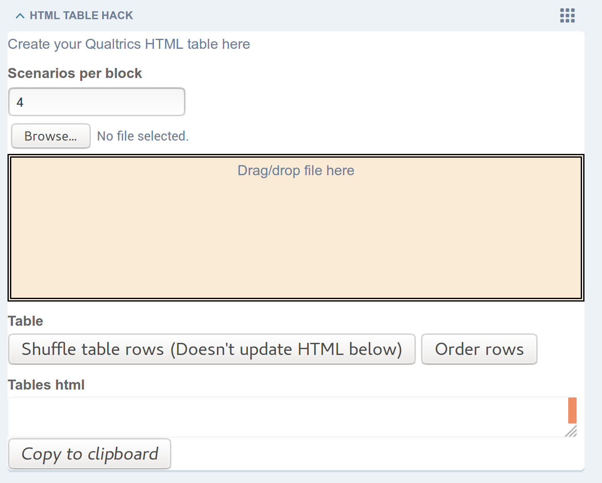

Generating the HTML
===================

The following instructions demonstrate how to generate the HTML tables to be shown within the questions in the Qualtrics survey.

------------------
Get the input file
------------------

See the section on :ref:`input data<input_data>` for details on creating the spreadsheet input file.

------------------------------
Create HTML via the Admin page
------------------------------

The admin page for the survey is found at ``https://<name_of_survey>.survey.<your_web_host_address>/admin`` and has numerous widgets for editing aspects of the survey. Locate the widget labeled "HTML TABLE HACK".

-------------------
Scenarios per block
-------------------

This information isn't currently recoverable from the input spreadsheet, so needs to be added manually.

It is the number of "Choice Situations" in each block, and so is the number of questions each participant will be asked to answer for a "block" to be completed.

------------------
Add the input data
------------------

Drag and drop or Browse buttons.

If using drag and drop, the "Drop Zone" will turn purple when the the dragged file is over the correct location.

The spreadsheet file is read via JavaScript in the browser, and produces two outputs below the drop zone.

The table itself is rendered below, with the Qualtrics specific metadata references in each cell.

Example, if a question has a choice between two jobs, and the salary is given for both, these values will be taken from the ``Attributes & Levels (2)`` file.

``${e://Field/attribute_h.salary}``

The ``attribute_h`` value is the "human readable" text, which could be a whole sentance such as "The average net monthly salary, averaged over a year".

This is also a way to implement i18n, as this "human readable" text can be any language, using any unicode characters.

``${e://Field/file.1_salary.a}``

``${e://Field/file.1_salary.b}``

``1_salary.a`` can be read as "Scenario 1, salary attribute, option A", and so has an option B alongside it. Any number of options can be displayed.

